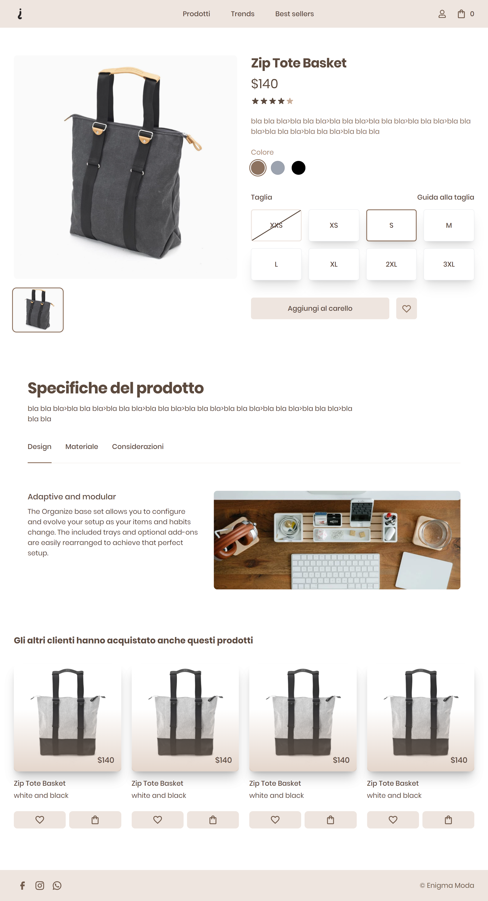

<a href=""></Link>

# Enigma Ecommerce Site 🔮

## Frontend ⚡

-   [**Next**](https://nextjs.org/) React framework written in tsx
-   [**Tailwind css**](https://tailwindcss.com/) CSS framework implemeented with next and daisyui
-   [**Zustand**](https://zustand-demo.pmnd.rs/) State Manager

## Backend 👨‍💻

-   [**Prisma**](https://www.prisma.io/) Prisma ORM used to create the headless CMS with admin access
-   [**Zod**](https://zod.dev/) TypeScript-first schema validation with static type inference

## Deployment 🚧

-   [**Supabase**](https://supabase.com/) Cloud platform for storage buckets & batabase

## Standard Api 🎯

-   [**TRPC**](https://trpc.io/) E2E Functions used to fetch data
-   [**Next-Auth**](https://next-auth.js.org/) Provider used to get session and auth for the user
-   [**Stripe**](https://stripe.com/) Payment api used on the checkout

## Database 🧱

-   [**Postgres**](https://www.postgresql.org/) Database used by strapi

## Dev&Ops / Linting 📦

-   [**CI/CD Github Actions**](https://docs.github.com/en/actions) Automations for the deployment and testing phase
-   [**Commitizen**](https://github.com/commitizen/cz-cli) Commit Linting CLI
-   [**Husky**](https://typicode.github.io/husky/#/) Auto pre-commit scripts to test types and code 
-   [**Ts-Lint**](https://typescript-eslint.io/) Linting for error and warning in the code
-   [**Prettier**](https://prettier.io/) Code Formatter

# My Socials 🤳

<a href="https://www.linkedin.com/in/samuele-antonio-barbiera-bb023320b/" target="blank"></Link>
<a href="https://stackoverflow.com/users/16105959" target="blank"></Link>
<a href="https://discord.gg/2Wj7hmP6Nf" target="blank"></Link>

# Donations 💸

  <a href="buymeacoffee.com/?via=samueleb" target="_blank">
    
  </Link>

# License ©️

This project is licensed under the MIT License - see the [LICENSE.md](LICENSE.md) file for details.
